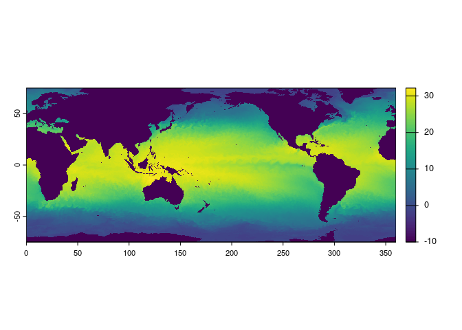

<!-- README.md is generated from README.Rmd. Please edit that file -->

# virtualized

An ongoing experiment to compare array virtualization in GDAL and in
xarray/VirtualiZarr. This repo exists purely to describe two ways of
connecting to a virtualized-netcdf store, with various software tools.

## A virtualized store

In directory
[remote/](https://github.com/mdsumner/virtualized/tree/main/remote/ocean_temp_2023.parq)
there is a nested Parquet representation of a modelled ocean variable
`ocean_temp`.

Note that for actually connecting to this we need the github raw link,
which isn’t a valid link in a browser but works for connection, that
looks like this:

    https://raw.githubusercontent.com/mdsumner/virtualized/refs/heads/main/remote/ocean_temp_2023.parq

The array `ocean_temp` has dimensions `Time,st_ocean,yt_ocean,xt_ocean`
of shape `(5599, 51, 1500, 3600)`. This consists of 180 *monthly, with
daily time step* NetCDF files that exist on the
[NCI](https://nci.org.au/) high performance computing system. The model
data is a product of the [Bluelink
Reanalysis](https://research.csiro.au/bluelink/global/reanalysis/) by
CSIRO. (We are using BRAN2023, but please note this is purely an
infrastructure exercise for now, a way to prototype future workflows).

The store was built by using
[VirtualiZarr](https://virtualizarr.readthedocs.io/en/latest/index.html)
in-situ on NCI, then pushing up the resulting [Parquet
kerchunk](https://fsspec.github.io/kerchunk/spec.html#parquet-references)
store to here on Github, and then re-naming the path references from
those in-situ on NCI, to publically available ones that are available
via the [NCI Thredds
server](https://thredds.nci.org.au/thredds/catalog/gb6/BRAN/BRAN2023/catalog.html).

## Limitations

We are using kerchunk Parquet, we are supposed to use Icechunk but that
won’t work in GDAL yet, and the tooling is more challenging in the
environments we currently need to use.

There is no guarantee an of this will continue to work, if we commit to
longer term support it will be on object storage hosting the indexes
(parquet or icechunk or materialized, or other).

## Example

Here we connect to the virtual Zarr store, this represents a very huge
logical array. We deploy different ways to read the same values from the
store for a basic illustration.

### xarray

First, we read it the *canonical* way with xarray:

``` python
import xarray
ds = xarray.open_dataset("https://raw.githubusercontent.com/mdsumner/virtualized/refs/heads/main/remote/ocean_temp_2023.parq", engine = "kerchunk", chunks = {})
ds
```

    <xarray.Dataset> Size: 12TB
    Dimensions:   (Time: 5599, st_ocean: 51, yt_ocean: 1500, xt_ocean: 3600)
    Coordinates:
      * Time      (Time) datetime64[ns] 45kB 2024-12-01T12:00:00 ... 2020-12-31T1...
      * st_ocean  (st_ocean) float64 408B 2.5 7.5 12.5 ... 3.603e+03 4.509e+03
      * xt_ocean  (xt_ocean) float64 29kB 0.05 0.15 0.25 0.35 ... 359.8 359.9 360.0
      * yt_ocean  (yt_ocean) float64 12kB -74.95 -74.85 -74.75 ... 74.75 74.85 74.95
    Data variables:
        temp      (Time, st_ocean, yt_ocean, xt_ocean) float64 12TB dask.array<chunksize=(1, 1, 300, 300), meta=np.ndarray>
    Attributes:
        filename:           TMP/ocean_temp_2024_12_01.nc.0000
        NumFilesInSet:      20
        title:              BRAN2023
        grid_type:          regular
        history:            Mon May 19 14:03:50 2025: ncrcat -4 --dfl_lvl 1 --cnk...
        NCO:                netCDF Operators version 5.0.5 (Homepage = http://nco...
        catalogue_doi_url:  https://dx.doi.org/10.25914/2wxj-vt48
        acknowledgement:    BRAN output is made freely available by CSIRO Bluelin...

run a lazy subset select and pull the values

``` python
ds.temp.isel(Time = 0, st_ocean = 10, yt_ocean = 100)
```

    <xarray.DataArray 'temp' (xt_ocean: 3600)> Size: 29kB
    dask.array<getitem, shape=(3600,), dtype=float64, chunksize=(300,), chunktype=numpy.ndarray>
    Coordinates:
        Time      datetime64[ns] 8B 2024-12-01T12:00:00
        st_ocean  float64 8B 65.67
      * xt_ocean  (xt_ocean) float64 29kB 0.05 0.15 0.25 0.35 ... 359.8 359.9 360.0
        yt_ocean  float64 8B -64.95
    Attributes:
        long_name:      Potential temperature
        units:          degrees C
        valid_range:    [-32767, 32767]
        packing:        4
        cell_methods:   time: mean Time: mean
        time_avg_info:  average_T1,average_T2,average_DT
        standard_name:  sea_water_potential_temperature

``` python
v = ds.temp.isel(Time = 0, st_ocean = 10, yt_ocean = 100).values
v
#array([-1.54072672, -1.5329445 , -1.52516228, ..., -1.5329445 ,
#       -1.54072672, -1.54850894], shape=(3600,))
```

### GDAL

Now use GDAL in multdim mode, we use an indexing approach with raw
numbers as with `isel()` above, using the multidim numpy-like syntax:

``` python
from osgeo import gdal

gdal.UseExceptions()

ds = gdal.OpenEx("ZARR:\"/vsicurl/https://raw.githubusercontent.com/mdsumner/virtualized/refs/heads/main/remote/ocean_temp_2023.parq\"", gdal.OF_MULTIDIM_RASTER)
rg = ds.GetRootGroup()
rg.GetMDArrayNames()
#['Time', 'st_ocean', 'temp', 'xt_ocean', 'yt_ocean']

temp = rg.OpenMDArrayFromFullname("/temp")
temp.shape
# (5599, 51, 1500, 3600)
view = temp.GetView("[0,10,100,:]")
a = view.ReadAsArray()
a * temp.GetScale() + temp.GetOffset()
#array([-1.54072672, -1.5329445 , -1.52516228, ..., -1.5329445 ,
#       -1.54072672, -1.54850894], shape=(3600,))
```

### R terra

Finally, a more traditional 2D view of this but we burrow in just for
argument’s sake.

(Deeper work on the multdim approach for GDAL is ongoing in
[gdalraster](https://github.com/USDAForestService/gdalraster)).

``` r
library(terra)
#> terra 1.8.64
dsn <- "ZARR:\"/vsicurl/https://raw.githubusercontent.com/mdsumner/virtualized/refs/heads/main/remote/ocean_temp_2023.parq\":/temp:{10}:{0}"

(r <- rast(dsn))
#> class       : SpatRaster 
#> size        : 1500, 3600, 1  (nrow, ncol, nlyr)
#> resolution  : 0.1, 0.1  (x, y)
#> extent      : -9.507305e-10, 360, -75, 75  (xmin, xmax, ymin, ymax)
#> coord. ref. :  
#> source      : temp:{10}:{0} 
#> name        : temp:{10}:{0}

plot(r)
```

<!-- -->

``` r
#terra 1.8.64
#class       : SpatRaster
#size        : 1500, 3600, 1  (nrow, ncol, nlyr)
#resolution  : 0.1, 0.1  (x, y)
#extent      : -9.507305e-10, 360, -75, 75  (xmin, xmax, ymin, ymax)
#coord. ref. :
#source      : temp:{0}:{10}
#name        : temp:{0}:{10}
```

(I’m not yet getting the exact same values out but the plot show the
values are valid, and mapped correctly).

We can leverage the GDAL api to cast these slices to classic raster
mode, and many other options.
